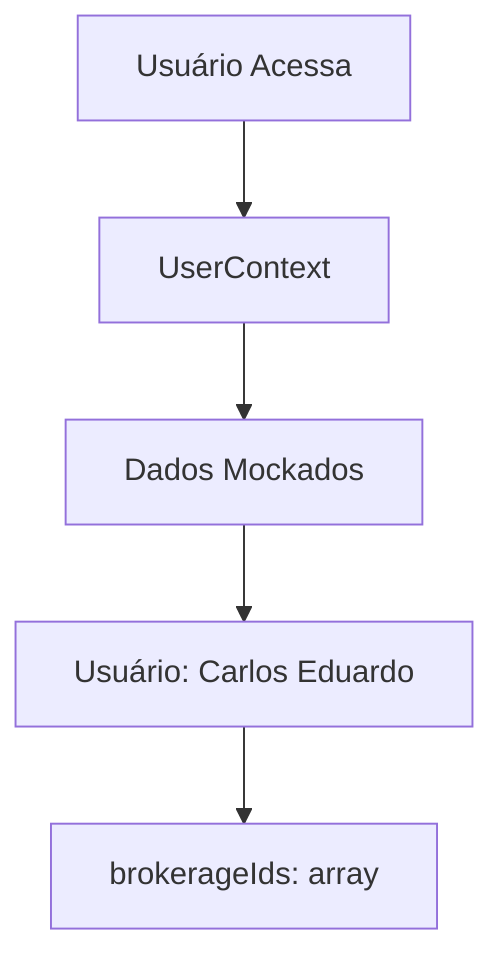
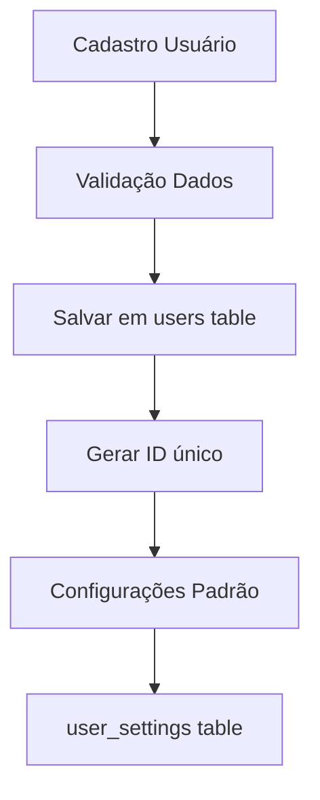
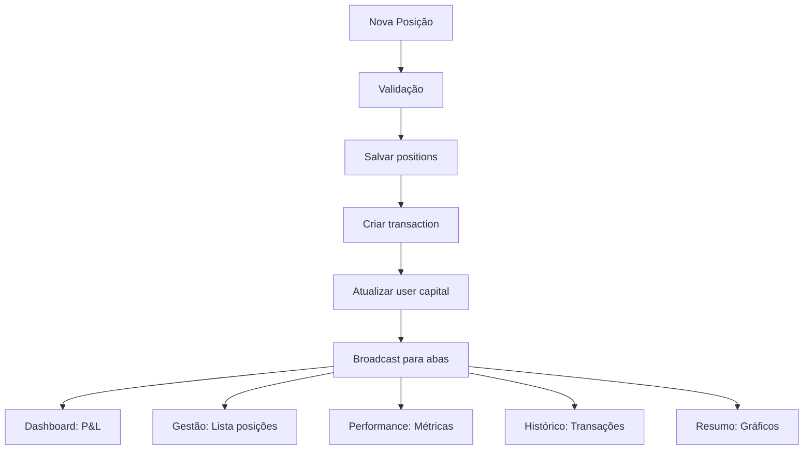

# 📊 ANÁLISE COMPLETA DO SISTEMA - ACEX TRADING PLATFORM

## 🔍 **ANÁLISE DO SALVAMENTO DE DADOS**

### **💾 ESTRUTURA ATUAL DE ARMAZENAMENTO:**

#### **1. BACKEND (PostgreSQL)**
```sql
📂 database/
├── 📄 schema.sql          ← Estrutura completa do banco
├── 📄 initial_data.sql    ← Dados de teste (PARA REMOVER)
└── 📁 seeds/             ← Scripts de inicialização
```

**✅ TABELAS PRINCIPAIS:**
- `users` - Usuários do sistema
- `contracts` - Contratos disponíveis (BGI, CCM)
- `positions` - Posições abertas/fechadas
- `options` - Opções e estratégias
- `transactions` - Histórico de transações
- `prices` - Preços históricos e atuais
- `user_settings` - Configurações por usuário

#### **2. FRONTEND (React Context)**
```typescript
📂 src/contexts/
├── 📄 DataContext.tsx     ← Gerencia posições, opções, transações
├── 📄 UserContext.tsx     ← Gerencia usuários e corretoras
└── 📄 FilterContext.tsx   ← Filtros e períodos
```

**⚠️ PROBLEMA IDENTIFICADO:**
- **Dados de teste** misturados com dados reais
- **Context** usando dados mockados
- **Falta integração** completa Backend ↔ Frontend

---

## 🏗️ **HIERARQUIA E SEQUÊNCIA DOS PROCESSOS**

### **1. CADASTRO DE USUÁRIO**

#### **📋 Fluxo Atual:**


#### **🎯 Fluxo Correto:**


**📝 CAMPOS OBRIGATÓRIOS:**
- Nome completo
- Email (único)
- CPF
- Telefone
- Endereço
- Capital inicial

### **1.1 CADASTRO DE CORRETORA**

#### **🔗 VÍNCULO USUÁRIO ↔ CORRETORA:**

**PROBLEMA ATUAL:**
- Não existe tabela `brokerages` no backend
- Relação apenas no frontend (mockado)
- Sem controle de acesso real

**SOLUÇÃO NECESSÁRIA:**
```sql
-- Criar tabela de corretoras
CREATE TABLE brokerages (
    id UUID PRIMARY KEY DEFAULT uuid_generate_v4(),
    nome VARCHAR(255) NOT NULL,
    cnpj VARCHAR(18) UNIQUE NOT NULL,
    endereco TEXT,
    assessor VARCHAR(255),
    telefone VARCHAR(20),
    email VARCHAR(255),
    corretagem_milho DECIMAL(10,2),
    corretagem_boi DECIMAL(10,2),
    taxas DECIMAL(10,2),
    impostos DECIMAL(10,2),
    is_active BOOLEAN DEFAULT true,
    created_at TIMESTAMP DEFAULT NOW()
);

-- Tabela de relacionamento M:N
CREATE TABLE user_brokerage_access (
    id UUID PRIMARY KEY DEFAULT uuid_generate_v4(),
    user_id UUID REFERENCES users(id),
    brokerage_id UUID REFERENCES brokerages(id),
    role VARCHAR(20) DEFAULT 'viewer', -- admin, trader, viewer
    granted_at TIMESTAMP DEFAULT NOW(),
    granted_by UUID REFERENCES users(id),
    is_active BOOLEAN DEFAULT true
);
```

#### **🔄 INTEGRAÇÃO USUÁRIO-CORRETORA:**
1. **Admin** cadastra corretora
2. **Admin** concede acesso a usuários
3. **Usuário** seleciona corretora ativa
4. **Todas operações** ficam vinculadas à corretora selecionada

---

## 2. **CADASTRO DE NOVA POSIÇÃO**

### **🔗 INTEGRAÇÃO COM TODAS AS ABAS:**

#### **📊 FLUXO COMPLETO:**


#### **📋 DADOS NECESSÁRIOS:**
```typescript
interface NovaPositao {
  // Básico
  user_id: string;
  brokerage_id: string;  // ← FALTANDO
  contract_id: string;
  
  // Posição
  direction: 'LONG' | 'SHORT';
  quantity: number;
  entry_price: number;
  
  // Opcionais
  stop_loss?: number;
  take_profit?: number;
  
  // Auto-calculados
  fees: number;  // % do valor total
  exposure: number;  // preço × quantidade × tamanho contrato
}
```

---

## 📈 **INTEGRAÇÃO ENTRE ABAS**

### **🎯 COMO OS DADOS FLUEM:**

#### **1. DASHBOARD (Rentabilidade)**
- **Fonte:** `positions` + `transactions`
- **Cálculos:** P&L total, diário, capital atual
- **Atualização:** Real-time via WebSocket

#### **2. POSIÇÕES**
- **Gestão:** Posições abertas
- **Performance:** Métricas por posição
- **Histórico:** Posições fechadas
- **Resumo:** Gráficos e análises

#### **3. OPÇÕES**
- **Fonte:** `options` + `option_strategies`
- **Análise Payoff:** Cálculos dinâmicos
- **Estratégias:** 8 tipos pré-definidos

#### **4. TRANSAÇÕES**
- **Fonte:** `transactions`
- **Filtros:** Por período, tipo, status
- **Exportação:** Relatórios

#### **5. PERFORMANCE**
- **Análise:** Multi-dimensional
- **Métricas:** Sharpe, drawdown, win rate
- **Comparação:** Benchmarks

#### **6. CONFIGURAÇÕES**
- **Usuários:** CRUD completo
- **Corretoras:** Gestão e acesso
- **API:** Configurações de conexão

---

## 🚨 **PROBLEMAS IDENTIFICADOS**

### **❌ DADOS DE TESTE PARA REMOVER:**

#### **1. Frontend (Context)**
```typescript
// ❌ REMOVER - src/contexts/DataContext.tsx
const initialPositions: Position[] = [
  // Dados mockados aqui
];

// ❌ REMOVER - src/contexts/UserContext.tsx  
const mockBrokerages: Brokerage[] = [
  // Dados mockados aqui
];
```

#### **2. Backend (Seeds)**
```sql
-- ❌ REMOVER - database/seeds/initial_data.sql
INSERT INTO users VALUES (...); -- Dados de teste
INSERT INTO positions VALUES (...); -- Posições de exemplo
```

### **❌ INTEGRAÇÕES FALTANDO:**

1. **Tabela `brokerages`** não existe no backend
2. **API Routes** para corretoras não implementadas
3. **Context** não integrado com backend
4. **WebSocket** para updates real-time
5. **Validações** de negócio incompletas

---

## ✅ **PLANO DE CORREÇÃO**

### **🎯 FASE 1: LIMPEZA DE DADOS**
1. **Remover** todos os dados de teste
2. **Limpar** contexts mockados
3. **Configurar** integração backend real

### **🎯 FASE 2: ESTRUTURA CORRETORAS**
1. **Criar** tabela `brokerages`
2. **Implementar** API routes
3. **Integrar** frontend ↔ backend

### **🎯 FASE 3: FLUXO COMPLETO**
1. **Cadastro usuário** → **Seleção corretora**
2. **Nova posição** → **Todas abas atualizadas**
3. **Validações** de negócio completas

### **🎯 FASE 4: TESTES REAIS**
1. **Dados internos** seus
2. **Fluxo completo** testado
3. **Performance** validada

---

## 🔄 **SEQUÊNCIA RECOMENDADA**

### **1º - USUÁRIO**
```sql
INSERT INTO users (name, email, cpf, initial_capital)
VALUES ('Carlos Eduardo', 'carlos@ceac.com', 'XXX.XXX.XXX-XX', 200000.00);
```

### **2º - CORRETORA**
```sql
INSERT INTO brokerages (nome, cnpj, assessor)
VALUES ('XP Investimentos', 'XX.XXX.XXX/0001-XX', 'Roberto Silva');
```

### **3º - VÍNCULO**
```sql
INSERT INTO user_brokerage_access (user_id, brokerage_id, role)
VALUES ('user-id', 'brokerage-id', 'admin');
```

### **4º - POSIÇÕES**
- Via interface web
- Dados reais seus
- Integração completa

---

**🎯 PRONTO PARA COMEÇAR A LIMPEZA E IMPLEMENTAR OS DADOS REAIS!** 