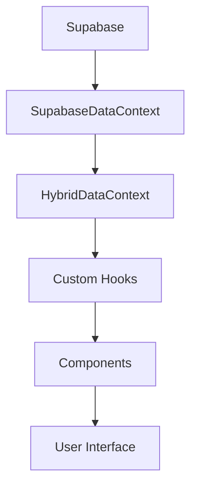

# 🏗️ Arquitetura e Bibliotecas - Sistema Boi Gordo

## 🎯 Visão Geral da Arquitetura

O sistema é construído com Next.js 15.4.2 e React 19.1.0, utilizando arquitetura moderna com Server Components, hooks customizados e integração com Supabase como backend.

## 📦 Stack Tecnológico

### Core Framework
```json
{
  "next": "15.4.2",
  "react": "19.1.0",
  "react-dom": "19.1.0",
  "typescript": "^5"
}
```

### Bibliotecas Principais

#### 🗄️ Backend & Database
- **@supabase/supabase-js** (^2.52.1)
  - Cliente JavaScript para Supabase
  - Autenticação, database e storage
  - Realtime subscriptions

#### 📊 Visualização de Dados
- **chart.js** (^4.5.0)
  - Biblioteca principal para gráficos
  - Suporte para múltiplos tipos de gráficos
  
- **react-chartjs-2** (^5.3.0)
  - Wrapper React para Chart.js
  - Componentes declarativos
  
- **recharts** (^3.1.0)
  - Biblioteca alternativa para gráficos
  - Componentes compostos e responsivos

- **chartjs-adapter-date-fns** (^3.0.0)
  - Adaptador para datas em Chart.js

#### 🎨 UI & Estilização
- **tailwindcss** (^4)
  - Framework CSS utility-first
  - Sistema de design customizado
  
- **tailwind-merge** (^3.3.1)
  - Merge de classes Tailwind sem conflitos
  
- **class-variance-authority** (^0.7.1)
  - Criação de variantes de componentes
  
- **clsx** (^2.1.1)
  - Utility para classes condicionais

#### 🎭 Animações & Feedback
- **framer-motion** (^12.23.6)
  - Biblioteca de animações declarativas
  - Gestos e transições complexas
  
- **react-hot-toast** (^2.5.2)
  - Sistema de notificações toast
  - Customizável e acessível

#### 🔧 Utilities
- **date-fns** (^4.1.0)
  - Manipulação e formatação de datas
  - Alternativa moderna ao Moment.js
  
- **lucide-react** (^0.525.0)
  - Ícones SVG otimizados
  - Tree-shakeable
  
- **@heroicons/react** (^2.2.0)
  - Ícones do Tailwind CSS team

## 🏛️ Estrutura de Pastas

```
boi-gordo-investimentos2/
├── src/
│   ├── app/                    # App Router (Next.js 13+)
│   │   ├── api/               # API Routes
│   │   ├── layout.tsx         # Layout principal
│   │   └── page.tsx           # Página inicial
│   │
│   ├── components/            # Componentes React
│   │   ├── Admin/            # Componentes administrativos
│   │   ├── Common/           # Componentes compartilhados
│   │   ├── Debug/            # Ferramentas de debug
│   │   ├── Demo/             # Componentes de demonstração
│   │   ├── Layout/           # Componentes de layout
│   │   ├── Modals/           # Sistema de modais
│   │   ├── Pages/            # Componentes de página
│   │   ├── Settings/         # Configurações
│   │   └── Trading/          # Componentes de trading
│   │
│   ├── contexts/             # React Contexts
│   │   ├── HybridDataContext.tsx
│   │   └── SupabaseDataContext.tsx
│   │
│   ├── hooks/                # Custom Hooks
│   │   ├── useNetPositions.ts
│   │   ├── useTheme.ts
│   │   └── useModal.ts
│   │
│   ├── lib/                  # Bibliotecas e configurações
│   │   └── supabase.ts
│   │
│   ├── styles/               # Estilos globais
│   │   └── globals.css
│   │
│   ├── types/                # TypeScript types
│   │   └── index.ts
│   │
│   ├── utils/                # Funções utilitárias
│   │   └── calculations.ts
│   │
│   └── config/               # Configurações
│       └── env.ts
│
├── public/                   # Assets estáticos
├── scripts/                  # Scripts de build
├── mcp-official/            # MCP Server
└── documentacao/            # Documentação
```

## 🔄 Fluxo de Dados

### 1. Context Pattern
```typescript
// HybridDataContext provê dados unificados
<HybridDataProvider>
  <SupabaseDataProvider>
    <App />
  </SupabaseDataProvider>
</HybridDataProvider>
```

### 2. Custom Hooks Pattern
```typescript
// Hook para posições NET
const { netPositions, loading, error } = useNetPositions();

// Hook para tema
const { theme, toggleTheme } = useTheme();

// Hook para modais
const { openModal, closeModal } = useModal();
```

### 3. Data Flow


## 🔐 Autenticação e Segurança

### Configuração Supabase
```typescript
// src/lib/supabase.ts
const supabaseUrl = ENV.NEXT_PUBLIC_SUPABASE_URL;
const supabaseAnonKey = ENV.NEXT_PUBLIC_SUPABASE_ANON_KEY;

export const supabase = createClient(supabaseUrl, supabaseAnonKey);
```

### Row Level Security (RLS)
- Todas as tabelas protegidas por RLS
- Políticas baseadas em user_id
- Isolamento completo entre usuários

## 🚀 Build e Deploy

### Scripts de Build
```json
{
  "scripts": {
    "dev": "next dev",
    "build": "next build && node scripts/post-build.js",
    "build:cf": "ESLINT_CONFIG_FILE=.eslintrc.prod.json next build && node scripts/post-build.js && node scripts/cloudflare-postbuild.js",
    "start": "next start",
    "lint": "next lint"
  }
}
```

### Cloudflare Pages
- Deploy automático via Wrangler
- Edge Functions para rotas dinâmicas
- Cache global via Cloudflare CDN

## 🔧 Configurações Importantes

### TypeScript Config
```json
{
  "compilerOptions": {
    "target": "ES2017",
    "lib": ["dom", "dom.iterable", "esnext"],
    "allowJs": true,
    "skipLibCheck": true,
    "strict": true,
    "forceConsistentCasingInFileNames": true,
    "noEmit": true,
    "esModuleInterop": true,
    "module": "esnext",
    "moduleResolution": "node",
    "resolveJsonModule": true,
    "isolatedModules": true,
    "jsx": "preserve",
    "incremental": true
  }
}
```

### Tailwind Config
```javascript
module.exports = {
  content: [
    './src/pages/**/*.{js,ts,jsx,tsx,mdx}',
    './src/components/**/*.{js,ts,jsx,tsx,mdx}',
    './src/app/**/*.{js,ts,jsx,tsx,mdx}',
  ],
  theme: {
    extend: {
      colors: {
        primary: 'var(--bg-primary)',
        secondary: 'var(--bg-secondary)',
        // ... cores customizadas
      }
    }
  },
  corePlugins: {
    preflight: false, // Desabilitado para estilos customizados
  }
}
```

## 🎯 Padrões de Código

### Component Pattern
```typescript
// Componente funcional com TypeScript
interface ComponentProps {
  data: SomeType;
  onAction: (id: string) => void;
}

export default function Component({ data, onAction }: ComponentProps) {
  // Hook calls no topo
  const [state, setState] = useState();
  const { contextData } = useContext();
  
  // Effects
  useEffect(() => {
    // Logic
  }, [dependencies]);
  
  // Handlers
  const handleClick = () => {
    onAction(data.id);
  };
  
  // Render
  return (
    <div className="component">
      {/* JSX */}
    </div>
  );
}
```

### Custom Hook Pattern
```typescript
export function useCustomHook(param: ParamType) {
  const [state, setState] = useState<StateType>();
  const [loading, setLoading] = useState(false);
  const [error, setError] = useState<Error | null>(null);
  
  useEffect(() => {
    // Side effects
  }, [param]);
  
  const action = useCallback(() => {
    // Action logic
  }, [dependencies]);
  
  return { state, loading, error, action };
}
```

## 📊 Performance Optimizations

### 1. Code Splitting
- Automático via Next.js dynamic imports
- Lazy loading de componentes pesados

### 2. Image Optimization
- Next.js Image component
- Lazy loading automático
- Formatos modernos (WebP, AVIF)

### 3. Bundle Size
- Tree shaking habilitado
- Imports específicos de bibliotecas
- Análise de bundle com @next/bundle-analyzer

### 4. Caching Strategy
```typescript
// Cache no Cloudflare Workers
const cache = caches.default;
const cacheKey = new Request(url.toString(), request);
const cachedResponse = await cache.match(cacheKey);
```

## 🛠️ Ferramentas de Desenvolvimento

### VS Code Extensions Recomendadas
- ESLint
- Prettier
- Tailwind CSS IntelliSense
- TypeScript Error Lens
- GitLens

### Debug Tools
- React Developer Tools
- Redux DevTools (para contexts)
- Network tab para Supabase calls

## 📱 Responsividade

### Breakpoints Padrão
```css
/* Mobile First Approach */
sm: 640px   /* Tablet pequeno */
md: 768px   /* Tablet */
lg: 1024px  /* Desktop pequeno */
xl: 1280px  /* Desktop */
2xl: 1536px /* Desktop grande */
```

### Componentes Responsivos
- Sidebar colapsável em mobile
- Tabelas com scroll horizontal
- Modais fullscreen em mobile
- Grid adaptativo

## 🔄 Estado Global

### Gerenciamento via Context API
```typescript
// Estados globais principais
- HybridDataContext: Dados de negócio
- ThemeContext: Tema da aplicação
- ModalContext: Controle de modais
- UserContext: Dados do usuário
```

### Persistência
- LocalStorage para preferências
- Supabase para dados de negócio
- SessionStorage para estado temporário

## 🚨 Tratamento de Erros

### Error Boundaries
```typescript
class ErrorBoundary extends Component {
  componentDidCatch(error: Error, errorInfo: ErrorInfo) {
    console.error('Error caught by boundary:', error, errorInfo);
  }
}
```

### Toast Notifications
```typescript
// Sucesso
toast.success('Operação realizada com sucesso!');

// Erro
toast.error('Erro ao processar operação');

// Loading
toast.loading('Processando...');
```

## 📈 Monitoramento

### Console Logs Estruturados
```typescript
console.log('🚀 App initialized');
console.log('✅ Supabase connected');
console.error('❌ Error:', error);
console.warn('⚠️ Warning:', message);
```

### Performance Metrics
- First Contentful Paint (FCP)
- Time to Interactive (TTI)
- Cumulative Layout Shift (CLS)

---

📅 **Atualizado em**: 27 de Julho de 2025  
🏗️ **Arquitetura**: v1.0.0