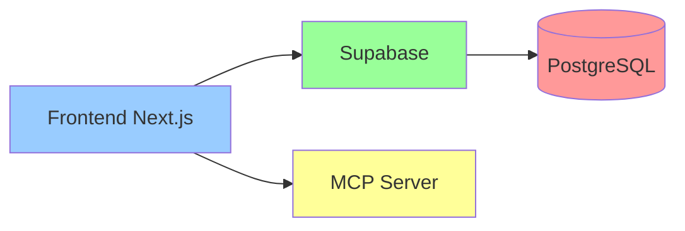

# 🎯 Análise: Necessidade de Backend Adicional

## 📋 Resumo Executivo

**Resposta curta**: Para esta aplicação de trading de commodities, **NÃO é necessário um backend adicional** além do Supabase. O backend Express existente é redundante e pode ser completamente removido.

## 🔍 Situação Atual

### O que temos:
1. **Supabase** - Backend completo com:
   - Database PostgreSQL
   - Autenticação integrada
   - Row Level Security (RLS)
   - Realtime subscriptions
   - Edge Functions (se necessário)
   
2. **Backend Express** - Tentativa de criar camada intermediária com:
   - Autenticação própria
   - Rate limiting
   - CORS handling
   - Rotas protegidas

## ❌ Por que o Backend Express é Desnecessário

### 1. **Duplicação de Funcionalidades**
O backend Express apenas replica o que o Supabase já oferece:

| Funcionalidade | Backend Express | Supabase |
|----------------|-----------------|----------|
| Database | ✅ Via Prisma/TypeORM | ✅ PostgreSQL nativo |
| Autenticação | ✅ JWT customizado | ✅ Auth integrado |
| Autorização | ✅ Middleware | ✅ RLS policies |
| Rate Limiting | ✅ express-rate-limit | ✅ Cloudflare + Supabase |
| CORS | ✅ cors middleware | ✅ Configurável |
| Realtime | ❌ Precisa WebSocket | ✅ Nativo |

### 2. **Complexidade Adicional**
- Mais um serviço para manter
- Mais um ponto de falha
- Latência adicional (frontend → backend → supabase)
- Custo adicional de hosting

### 3. **Segurança**
- RLS do Supabase é mais seguro que middleware customizado
- Menos superfície de ataque
- Autenticação gerenciada profissionalmente

## ✅ Quando um Backend Seria Necessário

### Cenários que justificariam um backend adicional:

#### 1. **Integrações com APIs Externas Sensíveis**
```typescript
// Exemplo: API de cotações em tempo real com chave privada
app.post('/api/quotes/realtime', async (req, res) => {
  const data = await fetch('https://commodities-api.com/quotes', {
    headers: {
      'API-KEY': process.env.PRIVATE_COMMODITIES_KEY // Não pode expor no frontend
    }
  });
  return res.json(await data.json());
});
```

#### 2. **Processamento Pesado/Assíncrono**
```typescript
// Exemplo: Cálculos complexos de risco
app.post('/api/risk/portfolio', async (req, res) => {
  // Processamento que levaria muito tempo no frontend
  const riskAnalysis = await calculateMonteCarloSimulation(req.body.portfolio);
  return res.json(riskAnalysis);
});
```

#### 3. **Webhooks de Terceiros**
```typescript
// Exemplo: Webhook de corretora
app.post('/webhook/broker/execution', async (req, res) => {
  // Validar assinatura do webhook
  if (!validateBrokerSignature(req)) {
    return res.status(401).send('Invalid signature');
  }
  // Processar execução de ordem
  await processOrderExecution(req.body);
});
```

#### 4. **Caching Avançado**
```typescript
// Exemplo: Cache de dados de mercado
app.get('/api/market/data/:symbol', cache('5 minutes'), async (req, res) => {
  // Redis cache para dados de mercado
  const cached = await redis.get(`market:${req.params.symbol}`);
  if (cached) return res.json(cached);
  
  const data = await fetchMarketData(req.params.symbol);
  await redis.setex(`market:${req.params.symbol}`, 300, data);
  return res.json(data);
});
```

## 🏗️ Arquitetura Recomendada

### Atual (Simplificada e Eficiente)


### Se precisar de funcionalidades extras no futuro:

#### Opção 1: Supabase Edge Functions
```typescript
// supabase/functions/calculate-risk/index.ts
import { serve } from 'https://deno.land/std@0.168.0/http/server.ts'

serve(async (req) => {
  const { portfolio } = await req.json()
  
  // Cálculos complexos aqui
  const risk = calculatePortfolioRisk(portfolio)
  
  return new Response(JSON.stringify({ risk }), {
    headers: { 'Content-Type': 'application/json' }
  })
})
```

#### Opção 2: Cloudflare Workers
```typescript
// Já temos a infraestrutura! Expandir o MCP Server
export default {
  async fetch(request: Request, env: Env) {
    const url = new URL(request.url);
    
    if (url.pathname === '/api/market-data') {
      // Buscar dados com chave privada
      const data = await fetchWithPrivateKey(env.MARKET_API_KEY);
      return new Response(JSON.stringify(data));
    }
  }
}
```

## 📊 Análise de Custos

### Arquitetura Atual (Sem Backend Express)
- **Supabase Free Tier**: $0/mês (suficiente para começar)
- **Cloudflare Pages**: $0/mês
- **Cloudflare Workers**: $0/mês (100k requests/dia grátis)
- **Total**: $0/mês

### Com Backend Express
- **Backend hosting**: ~$10-50/mês (Heroku, Railway, etc)
- **Database adicional**: ~$15/mês
- **Monitoramento**: ~$10/mês
- **Total adicional**: ~$35-75/mês

## 🎯 Recomendações

### Imediato
1. ✅ **REMOVER** o diretório `/backend` completamente
2. ✅ **MANTER** apenas Supabase como backend
3. ✅ **USAR** RLS policies para segurança

### Futuro (se necessário)
1. **APIs externas**: Usar Cloudflare Workers ou Supabase Edge Functions
2. **Processamento pesado**: Considerar serviço serverless (AWS Lambda, Vercel Functions)
3. **Webhooks**: Cloudflare Workers são perfeitos para isso
4. **WebSockets customizados**: Cloudflare Durable Objects

## 💡 Exemplo: Implementar Cotações em Tempo Real

Se no futuro precisar de cotações em tempo real com API privada:

### Usando Cloudflare Workers (Recomendado)
```typescript
// mcp-official/src/market-data.ts
export async function handleMarketData(request: Request, env: Env) {
  // Cache em KV Store
  const cached = await env.MARKET_DATA.get('quotes:BGI');
  if (cached) {
    return new Response(cached, {
      headers: { 'Cache-Control': 'max-age=60' }
    });
  }
  
  // Buscar dados frescos
  const response = await fetch('https://api.commodities.com/v1/quotes', {
    headers: {
      'Authorization': `Bearer ${env.COMMODITIES_API_KEY}`
    }
  });
  
  const data = await response.json();
  
  // Cachear por 1 minuto
  await env.MARKET_DATA.put('quotes:BGI', JSON.stringify(data), {
    expirationTtl: 60
  });
  
  return new Response(JSON.stringify(data));
}
```

## 📋 Checklist: Preciso de um Backend?

- [ ] Preciso chamar APIs com chaves privadas? → **Use Edge Functions**
- [ ] Preciso processar arquivos grandes? → **Use serviço especializado**
- [ ] Preciso de WebSockets customizados? → **Cloudflare Durable Objects**
- [ ] Preciso de cron jobs? → **Cloudflare Workers Cron Triggers**
- [ ] Preciso de autenticação customizada? → **Supabase Auth é extensível**
- [ ] Preciso de rate limiting? → **Cloudflare + Supabase já fazem isso**

**Se marcou algum item**: Ainda assim, provavelmente não precisa de um backend Express completo.

---

📅 **Criado em**: 27 de Julho de 2025  
💡 **Conclusão**: Backend Express é desnecessário e deve ser removido