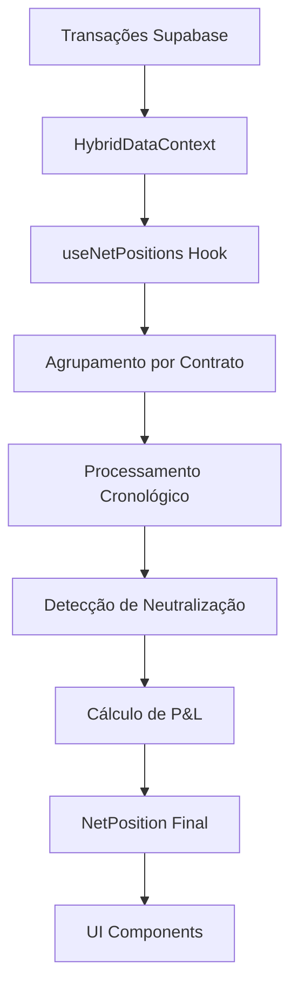

# 📊 Cálculos e Lógica de Negócio - Sistema Boi Gordo

## 🎯 Visão Geral

O sistema implementa cálculos complexos seguindo padrões do mercado de commodities, com suporte para operações LONG/SHORT, neutralização de posições e cálculo de P&L em tempo real.

## 🔢 Cálculos de Posições NET

### Conceito Principal
O sistema utiliza o modelo de posições NET, onde múltiplas transações no mesmo contrato são consolidadas em uma única posição líquida.

### Arquivo Principal: `/src/hooks/useNetPositions.ts`

#### Interface da Posição NET
```typescript
export interface NetPosition {
  contract: string;               // Código do contrato (ex: BGIU24)
  product: string;               // Produto (BGI, CCM)
  buyQuantity: number;           // Total de contratos comprados
  sellQuantity: number;          // Total de contratos vendidos
  netQuantity: number;           // Posição líquida (negativo = venda)
  netDirection: 'COMPRA' | 'VENDA' | 'NEUTRO';
  positions: Position[];         // Posições originais
  weightedEntryPrice: number;    // Preço médio ponderado
  currentPrice: number;          // Preço atual de mercado
  totalValue: number;            // Valor total da posição
  unrealizedPnL: number;         // P&L não realizado
  exposure: number;              // Exposição financeira
  accumulatedPnL?: number;       // P&L acumulado de operações parciais
}
```

### Algoritmo de Cálculo NET

#### 1. Agrupamento de Transações
```typescript
// Agrupa transações por contrato
const transactionsByContract = transactions.reduce((acc, transaction) => {
  if (!acc[transaction.contract]) {
    acc[transaction.contract] = [];
  }
  acc[transaction.contract].push(transaction);
  return acc;
}, {});
```

#### 2. Processamento Cronológico
O sistema processa transações em ordem cronológica para detectar neutralizações:

```typescript
sortedTransactions.forEach((currentTransaction) => {
  // Verifica se há neutralização com transações anteriores
  remainingTransactions.forEach((prevTransaction) => {
    if (isNeutralization(prevTransaction, currentTransaction)) {
      // Calcula P&L realizado
      const realizedPnL = calculateRealizedPnL(prevTransaction, currentTransaction);
      netPosition.accumulatedPnL += realizedPnL;
    }
  });
});
```

#### 3. Cálculo do Preço Médio Ponderado
```typescript
const calculateWeightedAveragePrice = (transactions: Transaction[]): number => {
  let totalValue = 0;
  let totalQuantity = 0;
  
  transactions.forEach(t => {
    totalValue += t.price * t.quantity;
    totalQuantity += t.quantity;
  });
  
  return totalQuantity > 0 ? totalValue / totalQuantity : 0;
};
```

#### 4. Detecção de Neutralização
```typescript
const isNeutralization = (t1: Transaction, t2: Transaction): boolean => {
  return t1.type !== t2.type; // COMPRA neutraliza VENDA e vice-versa
};
```

## 💰 Cálculos de P&L (Lucros e Perdas)

### Arquivo: `/src/utils/calculations.ts`

#### P&L Total
```typescript
export const calculateTotalPnL = (positions: Position[]): number => {
  return positions.reduce((total, position) => {
    const realizedPnL = position.realized_pnl || 0;
    const unrealizedPnL = position.unrealized_pnl || 0;
    return total + realizedPnL + unrealizedPnL;
  }, 0);
};
```

#### P&L por Posição NET
Para BGI (Boi Gordo) - 330 arrobas por contrato:
```typescript
const contractSize = 330; // arrobas
const pnl = netQuantity * contractSize * (currentPrice - weightedEntryPrice);
```

Para CCM (Milho) - 450 sacas por contrato:
```typescript
const contractSize = 450; // sacas
const pnl = netQuantity * contractSize * (currentPrice - weightedEntryPrice);
```

### Cálculo de Performance

#### ROI (Return on Investment)
```typescript
const roi = initialCapital > 0 ? (totalPnL / initialCapital) * 100 : 0;
```

#### Taxa de Acerto (Win Rate)
```typescript
const winningPositions = closedPositions.filter(pos => (pos.realized_pnl || 0) > 0);
const winRate = closedPositions.length > 0 
  ? (winningPositions.length / closedPositions.length) * 100 
  : 0;
```

## 🔄 Integrações entre Cálculos

### 1. HybridDataContext → useNetPositions
O contexto principal fornece as funções de cálculo NET:

```typescript
// Em HybridDataContext.tsx
calculateNetPosition: (contract: string, allPositions?: Position[]) => any;
getAllNetPositions: () => any[];
isPositionNeutralized: (positionId: string) => boolean;
```

### 2. Fluxo de Dados



### 3. Atualização em Tempo Real
```typescript
useEffect(() => {
  // Recalcula quando transações mudam
  const netPositions = calculateAllNetPositions(transactions);
  setNetPositions(netPositions);
}, [transactions]);
```

## 📈 Métricas de Risco

### Exposição Total
```typescript
const totalExposure = openPositions.reduce((total, position) => {
  const contractSize = position.contract.startsWith('BGI') ? 330 : 450;
  return total + (position.entryPrice * position.quantity * contractSize);
}, 0);
```

### Concentração de Risco
```typescript
const concentrationRisk = totalExposure > 0 
  ? (maxSingleExposure / totalExposure) * 100 
  : 0;
```

### Diversificação
```typescript
const uniqueAssets = new Set(openPositions.map(pos => pos.contract.substring(0, 3)));
const diversification = uniqueAssets.size;
```

## 🎯 Cálculos de Opções

### Payoff de Opções
```typescript
export const calculateOptionPayoff = (
  option: Option, 
  spotPrices: number[]
): { spotPrice: number; payoff: number }[] => {
  return spotPrices.map(spotPrice => {
    let intrinsicValue = 0;
    
    if (option.type === 'CALL') {
      intrinsicValue = Math.max(0, spotPrice - option.strike);
    } else { // PUT
      intrinsicValue = Math.max(0, option.strike - spotPrice);
    }
    
    const payoff = option.isPurchased 
      ? (intrinsicValue - option.premium) * option.quantity
      : (option.premium - intrinsicValue) * option.quantity;
    
    return { spotPrice, payoff };
  });
};
```

### Breakeven de Carteira
```typescript
export const calculatePortfolioBreakeven = (options: Option[]): number[] => {
  const totalPremium = options.reduce((sum, opt) => 
    sum + (opt.isPurchased ? opt.premium : -opt.premium) * opt.quantity, 0
  );

  if (mainOption.type === 'CALL') {
    return [mainOption.strike + Math.abs(totalPremium) / mainOption.quantity];
  } else {
    return [mainOption.strike - Math.abs(totalPremium) / mainOption.quantity];
  }
};
```

## 📊 Análise Temporal

### Agrupamento por Mês
```typescript
export const groupTransactionsByMonth = (transactions: Transaction[]) => {
  const months = ['Jan', 'Fev', 'Mar', 'Abr', 'Mai', 'Jun', 
                  'Jul', 'Ago', 'Set', 'Out', 'Nov', 'Dez'];
  
  transactions.forEach(transaction => {
    const date = new Date(transaction.createdAt);
    const monthIndex = date.getMonth();
    const monthName = months[monthIndex];
    
    monthlyStats[monthName].contracts += transaction.quantity;
    monthlyStats[monthName].volume += transaction.total;
    // ... cálculo de P&L mensal
  });
};
```

### Evolução do Capital
```typescript
export const generateCapitalEvolutionData = (
  monthlyData: any[], 
  initialCapital: number = 200000
) => {
  return monthlyData.map((month, index) => {
    const accumulated = monthlyData
      .slice(0, index + 1)
      .reduce((sum, m) => sum + m.pnl, 0);
    
    return {
      month: month.month,
      capital: initialCapital + accumulated
    };
  });
};
```

## 🔍 Validações e Consistência

### Validação de Neutralização
1. Transações devem ser de tipos opostos (COMPRA/VENDA)
2. Devem ser do mesmo contrato
3. Processamento em ordem cronológica é crítico

### Validação de P&L
```typescript
// Para posições fechadas
const calculatedPnL = (exit_price - entry_price) * quantity * contractSize;
const difference = Math.abs(calculatedPnL - realized_pnl);
// Diferença deve ser < 0.01 para garantir precisão
```

### Limpeza de Posições Órfãs
```typescript
const cleanOrphanedPositions = async () => {
  // Remove posições sem transações associadas
  const orphanedPositions = positions.filter(pos => 
    !transactions.some(t => t.position_id === pos.id)
  );
  // ... processo de limpeza
};
```

## 📋 Resumo das Especificações por Produto

### BGI (Boi Gordo)
- Tamanho do contrato: 330 arrobas
- Cálculo: `quantidade * 330 * (preço_atual - preço_entrada)`

### CCM (Milho)  
- Tamanho do contrato: 450 sacas
- Cálculo: `quantidade * 450 * (preço_atual - preço_entrada)`

### SFI (Soja)
- Segue modelo similar com tamanho específico

---

📅 **Atualizado em**: 27 de Julho de 2025  
🔥 **Versão**: 1.0.0