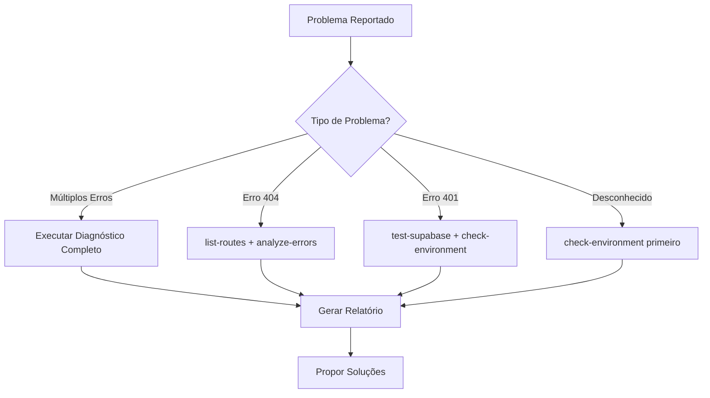

# 🤖 Protocolo MCP para Claude - Sistema Boi Gordo

## 📋 INSTRUÇÕES PARA CLAUDE

### Quando Usar MCP Automaticamente

Claude DEVE usar o MCP automaticamente quando:

1. **🚨 Múltiplos Erros (3+)**
   - Se o usuário reportar mais de 3 erros diferentes
   - Se encontrar erros em cascata durante investigação
   - Exemplo: "Está dando vários erros na aplicação"

2. **🔴 Erros Críticos**
   - Erro 401 (Unauthorized) 
   - Erro 404 em páginas que deveriam existir
   - Erro 500 (Server Error)
   - Timeout ou falha de conexão

3. **🔄 Após Mudanças**
   - Novo deployment realizado
   - Alteração de variáveis de ambiente
   - Atualização de dependências
   - Migração de banco de dados

4. **❓ Diagnóstico Remoto**
   - Quando não tiver acesso direto aos arquivos
   - Para verificar status em produção
   - Quando o usuário pedir "verifique se está funcionando"

### Fluxo de Diagnóstico com MCP



### Comandos MCP para Claude

#### 1. Diagnóstico Completo (SEMPRE começar com este)
```typescript
// Claude deve executar:
await Task({
  description: "Diagnóstico completo do sistema",
  prompt: `Executar diagnóstico completo usando MCP:
    1. curl -X POST https://boi-gordo-mcp-official.carlosedufaraujo.workers.dev/rpc -d '{"jsonrpc":"2.0","id":1,"method":"tools/call","params":{"name":"check-environment","arguments":{}}}'
    2. curl -X POST https://boi-gordo-mcp-official.carlosedufaraujo.workers.dev/rpc -d '{"jsonrpc":"2.0","id":2,"method":"tools/call","params":{"name":"test-supabase","arguments":{}}}'
    3. curl -X POST https://boi-gordo-mcp-official.carlosedufaraujo.workers.dev/rpc -d '{"jsonrpc":"2.0","id":3,"method":"tools/call","params":{"name":"list-routes","arguments":{"baseUrl":"https://plataforma-futuros.pages.dev"}}}'
    Compilar resultados em relatório estruturado.`,
  subagent_type: "general-purpose"
});
```

#### 2. Para Erro 404
```typescript
await Bash({
  command: `curl -X POST https://boi-gordo-mcp-official.carlosedufaraujo.workers.dev/rpc \
    -H "Content-Type: application/json" \
    -d '{
      "jsonrpc": "2.0",
      "id": 1,
      "method": "tools/call",
      "params": {
        "name": "analyze-errors",
        "arguments": {
          "errorCode": 404,
          "context": "${context}"
        }
      }
    }' | jq`,
  description: "Analisar erro 404 via MCP"
});
```

#### 3. Para Erro 401
```typescript
await Bash({
  command: `curl -X POST https://boi-gordo-mcp-official.carlosedufaraujo.workers.dev/rpc \
    -H "Content-Type: application/json" \
    -d '{
      "jsonrpc": "2.0",
      "id": 1,
      "method": "tools/call",
      "params": {
        "name": "test-supabase",
        "arguments": {}
      }
    }' | jq`,
  description: "Testar conexão Supabase via MCP"
});
```

### Template de Resposta para Claude

Após executar diagnóstico MCP, Claude deve responder assim:

```markdown
## 🔍 Diagnóstico MCP Executado

### Status Geral
- **MCP Server**: ✅/❌ [status]
- **Supabase**: ✅/❌ [status]
- **Frontend**: ✅/❌ [status]

### Problemas Identificados
1. [Problema 1 - descrição]
2. [Problema 2 - descrição]

### Soluções Propostas
1. **Para [Problema 1]**:
   - [Ação específica]
   - [Comando ou código]

2. **Para [Problema 2]**:
   - [Ação específica]
   - [Comando ou código]

### Próximos Passos
- [ ] [Ação 1]
- [ ] [Ação 2]
- [ ] [Verificar resultado com MCP]
```

### Regras Específicas para Claude

1. **SEMPRE** usar MCP antes de propor soluções complexas
2. **NUNCA** assumir que está tudo funcionando sem verificar
3. **SEMPRE** incluir o contexto do erro ao usar `analyze-errors`
4. **SEMPRE** verificar após implementar correções

### Exemplos de Uso

#### Exemplo 1: Usuário reporta "site não carrega"
```typescript
// Claude executa automaticamente:
1. Diagnóstico completo MCP
2. Se encontrar erro, usa analyze-errors com contexto
3. Propõe solução baseada no resultado
4. Após correção, verifica novamente com MCP
```

#### Exemplo 2: Após novo deployment
```typescript
// Claude executa automaticamente:
1. check-pages-deployment
2. list-routes
3. test-supabase
4. Confirma que tudo está funcionando
```

### Ferramentas MCP Disponíveis

| Ferramenta | Quando Usar | Parâmetros |
|------------|-------------|------------|
| `check-environment` | Sempre primeiro | Nenhum |
| `test-supabase` | Erros 401 ou BD | Nenhum |
| `check-pages-deployment` | Após deploy | `pagesUrl` |
| `analyze-errors` | Qualquer erro HTTP | `errorCode`, `context` |
| `list-routes` | Erros 404 | `baseUrl` |

### 🚨 IMPORTANTE PARA CLAUDE

**Se o usuário disser qualquer uma destas frases, use MCP IMEDIATAMENTE:**
- "Está dando erro"
- "Não está funcionando"
- "Verifique se está tudo ok"
- "Fiz deploy mas não funciona"
- "A página não carrega"
- "Supabase não conecta"
- "Deu 404/401/500"

### Configuração no Claude Desktop

Para integrar com Claude Desktop, adicionar em `claude_desktop_config.json`:

```json
{
  "mcpServers": {
    "boi-gordo-diagnostics": {
      "command": "npx",
      "args": [
        "@modelcontextprotocol/server-fetch",
        "https://boi-gordo-mcp-official.carlosedufaraujo.workers.dev/sse"
      ]
    }
  }
}
```

---

## 📊 Métricas de Uso

Claude deve registrar:
- Quantas vezes usou MCP
- Quais erros foram mais comuns
- Taxa de resolução após usar MCP
- Tempo médio de diagnóstico

## 🔄 Atualização

Este protocolo deve ser revisado:
- Após cada erro novo não coberto
- Mensalmente para otimizações
- Quando novas ferramentas MCP forem adicionadas