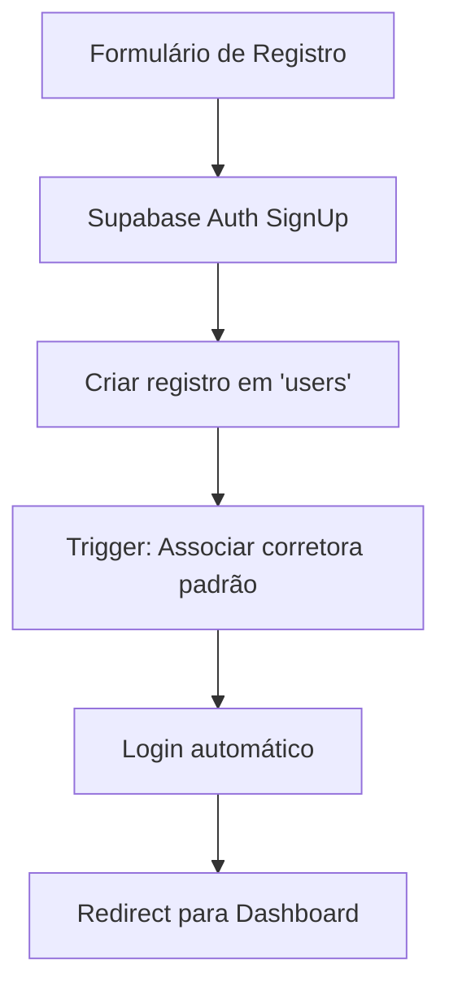
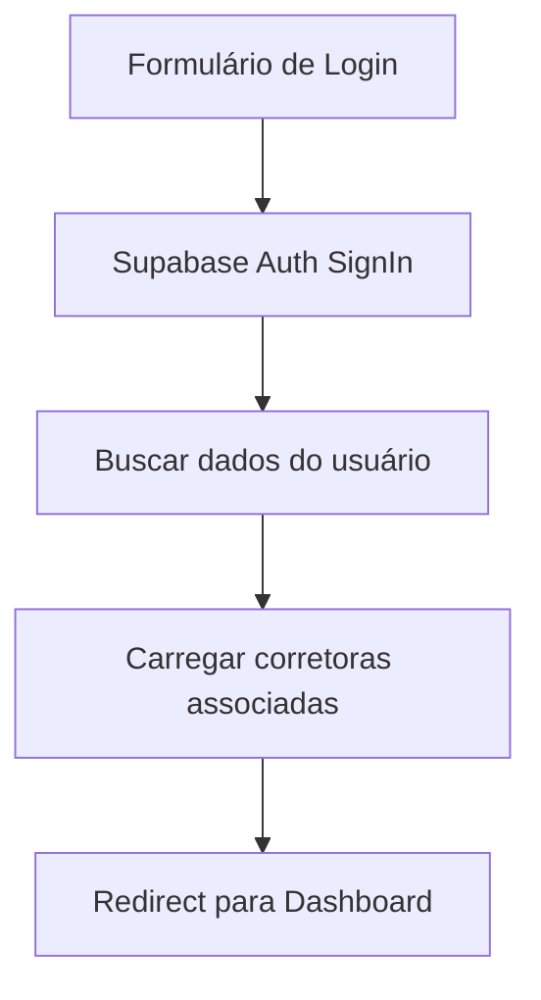

# 🔐 Sistema de Autenticação - Boi Gordo Investimentos

## 📋 Visão Geral

O sistema de autenticação foi implementado utilizando **Supabase Auth** integrado com o banco de dados PostgreSQL. Toda a aplicação agora está protegida por login, com vinculação automática entre usuários e corretoras.

## 🏗️ Arquitetura

### Componentes Principais

1. **Página de Login** (`/src/app/login/page.tsx`)
   - Interface única para login e registro
   - Validação de formulários
   - Formatação automática de CPF e telefone

2. **AuthContext** (`/src/contexts/AuthContext.tsx`)
   - Gerenciamento do estado de autenticação
   - Integração com Supabase Auth
   - Funções de login, registro e logout

3. **ProtectedRoute** (`/src/components/Auth/ProtectedRoute.tsx`)
   - Componente wrapper para proteger rotas
   - Redirecionamento automático para login

4. **UserContext** (`/src/contexts/UserContext.tsx`)
   - Gerenciamento de dados do usuário
   - Vinculação com corretoras
   - Cache de sessão

## 🔄 Fluxo de Autenticação

### 1. Registro de Novo Usuário


### 2. Login de Usuário Existente


## 📊 Estrutura do Banco de Dados

### Tabela: users
```sql
CREATE TABLE users (
    id UUID PRIMARY KEY DEFAULT gen_random_uuid(),
    nome VARCHAR(255) NOT NULL,
    cpf VARCHAR(14) UNIQUE NOT NULL,
    email VARCHAR(255) UNIQUE NOT NULL,
    telefone VARCHAR(20),
    endereco TEXT,
    is_active BOOLEAN DEFAULT true,
    created_at TIMESTAMP WITH TIME ZONE DEFAULT NOW(),
    updated_at TIMESTAMP WITH TIME ZONE DEFAULT NOW()
);
```

### Tabela: user_brokerages
```sql
CREATE TABLE user_brokerages (
    id UUID PRIMARY KEY DEFAULT gen_random_uuid(),
    user_id UUID REFERENCES users(id) ON DELETE CASCADE,
    brokerage_id UUID REFERENCES brokerages(id) ON DELETE CASCADE,
    role VARCHAR(20) DEFAULT 'trader',
    created_at TIMESTAMP WITH TIME ZONE DEFAULT NOW(),
    UNIQUE(user_id, brokerage_id)
);
```

## 🔒 Row Level Security (RLS)

### Políticas Implementadas

1. **users**
   - Usuários podem ver/editar apenas seu próprio perfil
   - Insert permitido durante registro (auth.uid() = id)

2. **positions/transactions/options**
   - Usuários veem apenas seus próprios dados
   - CRUD completo nos próprios registros

3. **brokerages**
   - Usuários veem apenas corretoras às quais têm acesso
   - Apenas admins podem criar/editar

4. **contracts**
   - Todos usuários autenticados podem visualizar
   - Apenas admins podem gerenciar

## 🚀 Como Usar

### 1. Proteger uma Rota
```typescript
import ProtectedRoute from '@/components/Auth/ProtectedRoute';

export default function MinhaPagePage() {
  return (
    <ProtectedRoute>
      <MeuComponente />
    </ProtectedRoute>
  );
}
```

### 2. Acessar Dados do Usuário
```typescript
import { useAuth } from '@/contexts/AuthContext';

function MeuComponente() {
  const { user, signOut } = useAuth();
  
  return (
    <div>
      <p>Olá, {user?.nome}!</p>
      <button onClick={signOut}>Sair</button>
    </div>
  );
}
```

### 3. Verificar Acesso a Corretoras
```typescript
import { useUser } from '@/contexts/UserContext';

function SeletorCorretora() {
  const { currentSession } = useUser();
  const { availableBrokerages, selectedBrokerage } = currentSession;
  
  return (
    <select value={selectedBrokerage?.id}>
      {availableBrokerages.map(b => (
        <option key={b.id} value={b.id}>{b.nome}</option>
      ))}
    </select>
  );
}
```

## 🔧 Configuração no Supabase

### 1. Aplicar as Políticas RLS
```bash
# Execute o arquivo SQL no Supabase
database/rls_policies.sql
```

### 2. Configurar Authentication
1. Acesse o painel do Supabase
2. Vá em Authentication → Providers
3. Habilite "Email" como provider
4. Configure as opções:
   - Confirm email: Desabilitado (para desenvolvimento)
   - Secure email change: Habilitado
   - Secure password change: Habilitado

### 3. Variáveis de Ambiente
```typescript
// src/config/env.ts
NEXT_PUBLIC_SUPABASE_URL=https://seu-projeto.supabase.co
NEXT_PUBLIC_SUPABASE_ANON_KEY=sua-chave-anonima
```

## 📱 Funcionalidades Implementadas

### ✅ Completas
- [x] Página de login/registro responsiva
- [x] Validação de formulários
- [x] Formatação automática de CPF e telefone
- [x] Integração com Supabase Auth
- [x] Proteção de rotas
- [x] Logout funcional no sidebar
- [x] Vinculação automática com corretora padrão
- [x] RLS policies para isolamento de dados

### 🔄 Futuras Melhorias
- [ ] Recuperação de senha
- [ ] Login social (Google, etc)
- [ ] Two-factor authentication (2FA)
- [ ] Logs de acesso
- [ ] Gestão de permissões por role
- [ ] Dashboard de administrador

## 🐛 Troubleshooting

### Erro: "User not found"
- Verifique se o registro foi criado na tabela `users`
- Confirme que o ID do Supabase Auth corresponde ao ID na tabela

### Erro: "Permission denied"
- Verifique as políticas RLS
- Confirme que o usuário está autenticado
- Verifique a associação user_brokerages

### Erro: "Invalid login credentials"
- Email ou senha incorretos
- Conta pode estar desativada (is_active = false)

## 📝 Notas de Segurança

1. **Nunca exponha a service_role_key** no frontend
2. **Use sempre a anon_key** para operações do cliente
3. **RLS deve estar habilitado** em todas as tabelas
4. **Valide dados** no frontend e backend
5. **Use HTTPS** em produção

---

📅 **Implementado em**: 27 de Julho de 2025  
🔐 **Versão**: 1.0.0