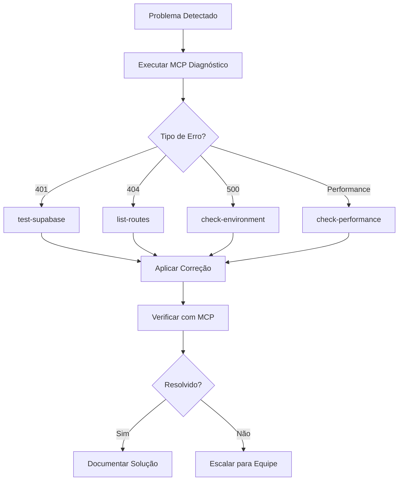

# 🔧 Troubleshooting Avançado - Sistema Boi Gordo

## 🚨 Problemas Críticos e Soluções

### 1. Sistema Completamente Fora do Ar

#### Diagnóstico via MCP
```bash
# Executar imediatamente
curl -X POST https://boi-gordo-mcp-official.carlosedufaraujo.workers.dev/rpc \
  -H "Content-Type: application/json" \
  -d '{"jsonrpc":"2.0","id":1,"method":"tools/call","params":{"name":"health-check-detailed","arguments":{"includeMetrics":true}}}' | jq
```

#### Checklist de Verificação
- [ ] MCP Server está respondendo?
- [ ] Cloudflare Pages está ativo?
- [ ] Supabase está acessível?
- [ ] DNS está resolvendo corretamente?

#### Solução Rápida
```bash
# 1. Verificar status dos serviços
curl -I https://plataforma-futuros.pages.dev
curl -I https://boi-gordo-mcp-official.carlosedufaraujo.workers.dev/health
curl -I https://kdfevkbwohcajcwrqzor.supabase.co/rest/v1/

# 2. Se Pages estiver down, fazer redeploy
cd /caminho/do/projeto
npm run build:cf
npx wrangler pages deploy out --project-name=plataforma-futuros --commit-dirty=true

# 3. Se Workers estiver down, fazer redeploy
cd mcp-official
npx wrangler deploy
```

### 2. Erro 401 - Unauthorized (Supabase)

#### Diagnóstico
```bash
# Via MCP
curl -X POST https://boi-gordo-mcp-official.carlosedufaraujo.workers.dev/rpc \
  -d '{"jsonrpc":"2.0","id":1,"method":"tools/call","params":{"name":"test-supabase","arguments":{}}}' | jq
```

#### Causas Comuns
1. **Chave expirada**: Verificar data de expiração no JWT
2. **Chave incorreta**: Verificar se está usando anon key (não service key)
3. **CORS bloqueado**: Verificar allowed origins no Supabase

#### Solução
```typescript
// 1. Atualizar em src/config/env.ts
const defaultConfig: EnvConfig = {
  NEXT_PUBLIC_SUPABASE_URL: 'https://kdfevkbwohcajcwrqzor.supabase.co',
  NEXT_PUBLIC_SUPABASE_ANON_KEY: 'NOVA_CHAVE_AQUI',
  // ...
};

// 2. Rebuild e deploy
npm run build:cf && npx wrangler pages deploy out --project-name=plataforma-futuros --commit-dirty=true
```

### 3. Erro 404 - Páginas Não Encontradas

#### Diagnóstico
```bash
# Listar todas as rotas
curl -X POST https://boi-gordo-mcp-official.carlosedufaraujo.workers.dev/rpc \
  -d '{"jsonrpc":"2.0","id":1,"method":"tools/call","params":{"name":"list-routes","arguments":{"baseUrl":"https://plataforma-futuros.pages.dev"}}}' | jq
```

#### Verificações
```bash
# 1. Verificar se arquivos existem no build
ls -la out/debug/
ls -la out/diagnostics/

# 2. Verificar _redirects
cat out/_redirects

# 3. Verificar _routes.json
cat out/_routes.json
```

#### Solução
```javascript
// 1. Verificar functions/[[catchall]].js
export async function onRequest(context) {
  const url = new URL(context.request.url);
  const pathname = url.pathname;
  
  // Adicionar log para debug
  console.log('Requested path:', pathname);
  
  // ... resto do código
}

// 2. Atualizar _redirects
/debug              /debug/index.html       200
/diagnostics        /diagnostics/index.html 200
/*                  /index.html             200

// 3. Rebuild com logs
npm run build:cf
```

### 4. Performance Degradada

#### Diagnóstico
```bash
# Medir tempos de resposta
time curl -s https://plataforma-futuros.pages.dev > /dev/null
time curl -s https://kdfevkbwohcajcwrqzor.supabase.co/rest/v1/users?limit=1 \
  -H "apikey: YOUR_KEY" > /dev/null
```

#### Análise via MCP
```bash
curl -X POST https://boi-gordo-mcp-official.carlosedufaraujo.workers.dev/rpc \
  -d '{"jsonrpc":"2.0","id":1,"method":"tools/call","params":{"name":"check-performance","arguments":{"operations":["list-positions","calculate-pnl"]}}}' | jq
```

#### Otimizações
1. **Cache no Cloudflare Workers**
```typescript
// Adicionar cache em mcp-official/src/index.ts
const cache = caches.default;
const cacheKey = new Request(url.toString(), request);
const cachedResponse = await cache.match(cacheKey);

if (cachedResponse) {
  return cachedResponse;
}
```

2. **Otimizar queries Supabase**
```typescript
// Usar select específico
const { data } = await supabase
  .from('positions')
  .select('id, contract, quantity, entry_price, current_price')
  .eq('status', 'open')
  .limit(50);
```

### 5. Dados Inconsistentes

#### Diagnóstico
```bash
# Verificar integridade dos dados
curl -X POST https://boi-gordo-mcp-official.carlosedufaraujo.workers.dev/rpc \
  -d '{"jsonrpc":"2.0","id":1,"method":"tools/call","params":{"name":"validate-positions","arguments":{"autoFix":false}}}' | jq
```

#### Queries de Validação
```sql
-- Verificar posições órfãs
SELECT p.* FROM positions p
LEFT JOIN users u ON p.user_id = u.id
WHERE u.id IS NULL;

-- Verificar transações sem posição
SELECT t.* FROM transactions t
LEFT JOIN positions p ON t.position_id = p.id
WHERE p.id IS NULL;

-- Verificar cálculos de PnL
SELECT 
  id,
  (exit_price - entry_price) * quantity as calculated_pnl,
  realized_pnl,
  ABS((exit_price - entry_price) * quantity - realized_pnl) as difference
FROM positions
WHERE status = 'closed'
AND ABS((exit_price - entry_price) * quantity - realized_pnl) > 0.01;
```

### 6. Variáveis de Ambiente Não Carregando

#### Diagnóstico Completo
```bash
# 1. Verificar localmente
node scripts/debug-env.js

# 2. Verificar no MCP
curl -X POST https://boi-gordo-mcp-official.carlosedufaraujo.workers.dev/rpc \
  -d '{"jsonrpc":"2.0","id":1,"method":"tools/call","params":{"name":"check-environment","arguments":{}}}' | jq

# 3. Verificar no browser
# Abrir: https://plataforma-futuros.pages.dev/debug/
```

#### Solução Definitiva
```typescript
// Sempre usar src/config/env.ts
import { ENV } from '@/config/env';

// NUNCA usar
// process.env.NEXT_PUBLIC_...

// SEMPRE usar
// ENV.NEXT_PUBLIC_...
```

## 🔄 Fluxo de Resolução de Problemas



## 📱 Contatos de Emergência

### Serviços Críticos
- **Cloudflare Status**: https://www.cloudflarestatus.com/
- **Supabase Status**: https://status.supabase.com/
- **Vercel Status**: https://www.vercel-status.com/

### Comandos de Emergência
```bash
# Rollback rápido
git revert HEAD
npm run build:cf
npx wrangler pages deploy out --project-name=plataforma-futuros --commit-dirty=true

# Desabilitar temporariamente funcionalidade
# Adicionar em src/config/env.ts
export const FEATURES = {
  ENABLE_TRADING: false, // Desabilitar temporariamente
  ENABLE_REPORTS: true,
  // ...
};
```

## 🎯 Prevenção de Problemas

### Checklist Pré-Deploy
- [ ] Executar testes locais
- [ ] Verificar variáveis de ambiente
- [ ] Testar com MCP local
- [ ] Fazer backup dos dados críticos
- [ ] Ter plano de rollback pronto

### Monitoramento Contínuo
```bash
# Criar cron job para verificação a cada 5 minutos
*/5 * * * * curl -X POST https://boi-gordo-mcp-official.carlosedufaraujo.workers.dev/rpc \
  -d '{"jsonrpc":"2.0","id":1,"method":"tools/call","params":{"name":"health-check-detailed","arguments":{"includeMetrics":true}}}' \
  >> /var/log/boi-gordo-health.log 2>&1
```

---

📅 **Atualizado em**: 27 de Julho de 2025
🔥 **Linha Direta**: Use MCP primeiro, sempre!